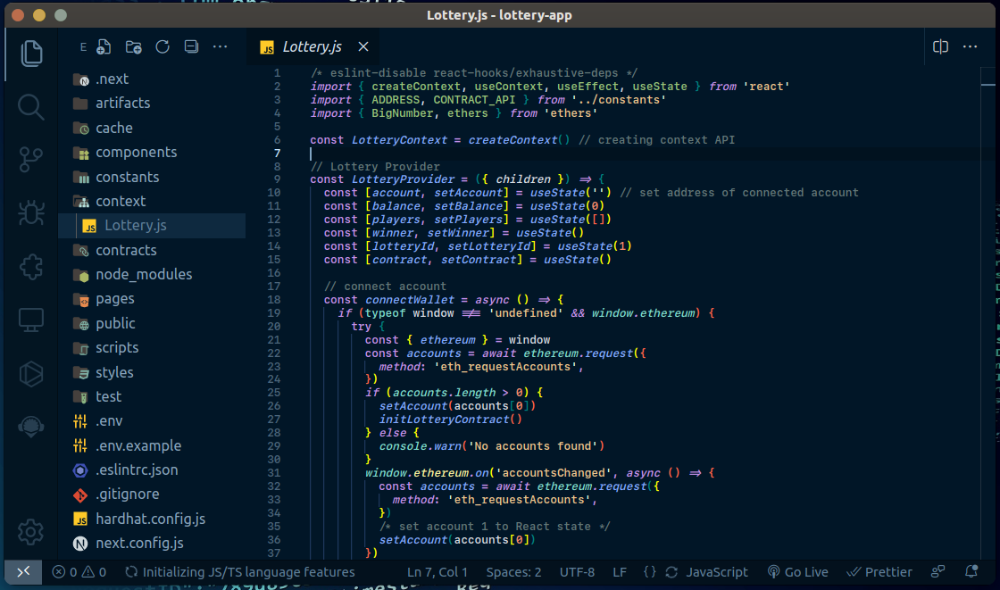

# Eye Themes

## Install

1. Go to [VS Marketplace](https://marketplace.visualstudio.com/items?itemName=eye).
2. Click on the "Install" button.
3. Then [select a theme](https://code.visualstudio.com/docs/getstarted/themes#_selecting-the-color-theme).
   - Dark: `Eye`

## License

[License](./LICENSE)
